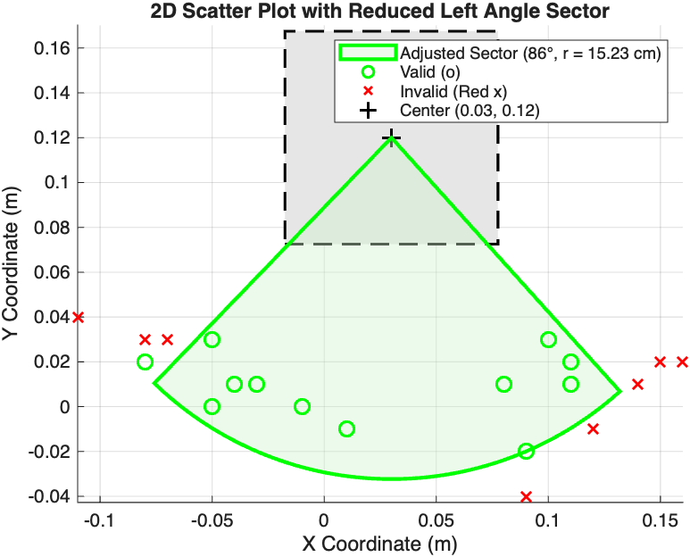

# Robotics Engineering Portfolio
**Aradhya Verma** | University of Wisconsin–Madison  
[verma48@wisc.edu](mailto:verma48@wisc.edu) | +1 (608)-217-8658

Autonomous systems, subsea avionics, and closed-loop manipulation portfolio.

---

## 1. FloatForm: Modular Self-Reconfiguring Robotic Boats
*Marine Robotics Laboratory | Research under Prof. Wei Wang*

Autonomous surface vessel (ASV) platform capable of multi-robot self-assembly, relative pose tracking, and autonomous docking maneuvers.

### Hardware Assembly & Fleet Fabrication
| Fleet Fabrication (5 Units) | Hull & Cross-Fin Architecture |
| :---: | :---: |
|  |  |

* **Modular Fabrication:** Assembled and wired 5 autonomous surface vessel (ASV) units using 3D-printed resin hulls, laser-cut acrylic top plates, cross-fin stabilizers, and custom 4-thruster omnidirectional vector arrays.
* **Auxetic Latching Mechanism:** Built and bench-tested an origami-inspired auxetic permanent magnet latching mechanism driven by a central servo and 3D-printed gearbox to maintain zero-power rigid connection across adjacent modules.
* **Thrust Profiling:** Conducted benchtop force sensor testing on miniature thrusters to evaluate dynamic response profiles, hydrodynamic deadbands, and rotational inertia compensation.

### Relative Pose Tracking & Docking Capture Sector
| Dynamic Docking & AprilTag Tracking | Docking Acceptance Envelope (MATLAB) |
| :---: | :---: |
| <video src="test_19.mp4" controls="controls" muted="muted" width="100%"></video> |  |

* **Real-Time Relative Perception:** Integrated an OpenCV and AprilTag pipeline to estimate continuous inter-robot distance and relative angular heading during docking runs.
* **Empirical Validation:** Processed experimental docking trial coordinates in MATLAB to determine the empirical magnetic capture envelope (86° acceptance sector, 15.23 cm capture radius).
* **Code & Data Artifacts:** [Scatterplot.m](./Scatterplot.m) | [latching_area.py](./latching_area.py) | [experiment_data.csv](./experiment_data.csv)
* **Publication Reference:** *Nature Communications* (2026) [doi:10.1038/s41467-026-74527-6](https://doi.org/10.1038/s41467-026-74527-6)

---

## 2. BlueROV Subsea Platform & Custom Payload Integration
*Marine Robotics Laboratory*

Underwater Remotely Operated Vehicle (ROV) configured for subsea maneuverability and auxiliary payload integration.

### System Packaging & Integration
| Integrated ROV & Handheld Controller |
| :---: |
|  |

* **CAD & Chassis Prototyping:** Modeled a custom internal mounting chassis in CAD to position and secure internal avionics, motor ESCs, terminal breakout blocks, and an onboard camera within a cylindrical acrylic pressure hull.
* **Subsea Avionics Integration:** Built internal power and signal harnesses connecting an onboard Navigator/Arduino flight controller, high-current lithium power distribution, and tethered Ethernet for live control.
* **Hull Sealing & Dynamic Testing:** Assembled pressure enclosure using radial O-rings and sealed penetrators; calibrated thruster deadbands and executed in-tank dynamic testing via game controller to evaluate trim, buoyancy, and watertight sealing integrity.

---

## 3. Autonomous Pick-and-Place Manipulation (UR5e Capstone)
*Webots Robotics Simulation*

Autonomous color-based sorting pipeline utilizing a 6-DOF UR5e robotic manipulator and wrist-mounted RGB camera in Webots.

### Simulation Demo
<video src="capstone.MOV" controls="controls" muted="muted" width="100%"></video>

* **Vision-Based Grasping:** Implemented color segmentation and centroid detection via a wrist-mounted RGB camera stream to calculate 3D object coordinates and trigger real-time grasp routines.
* **Kinematics & Trajectory Control:** Derived and implemented forward/inverse kinematics (FK/IK) and Jacobian-based path planning to execute smooth multi-axis pick-and-place trajectories.
* **Closed-Loop Automation:** Evaluated task reliability and fault-recovery behavior across repeated automated sorting cycles.
* **Project Artifacts:** [arm_ik.py](./arm_ik.py) | [color_sort_controller.py](./color_sort_controller.py) | [kinematic_helpers.py](./kinematic_helpers.py) | [color_sorting.wbt](./color_sorting.wbt)
```[cite: 1, 2, 5, 6, 7, 20]
