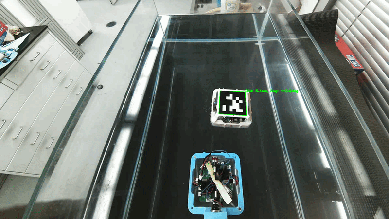
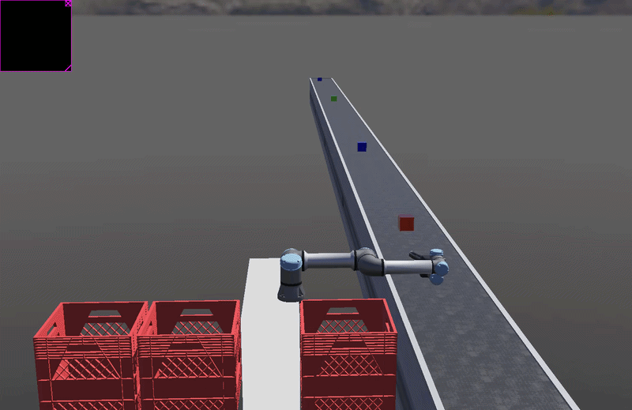

# Robotics Engineering Portfolio
**Aradhya Verma** | University of Wisconsin–Madison  
+1 (608)-217-8658 • [verma48@wisc.edu](mailto:verma48@wisc.edu)[cite: 7]

Autonomous systems, marine robotics hardware, and robotic manipulation portfolio featuring rapid prototyping, subsea avionics integration, computer vision perception, and closed-loop kinematic control.

---

## 1. FloatForm: Modular Swarm Robotic Boats
*Marine Robotics Laboratory | June – July 2026*[cite: 1]

Autonomous surface vessel (ASV) research platform designed for multi-agent self-assembly, relative pose tracking, and passive magnetic docking.

### Full-Stack Hardware Bring-Up

  [cite: 13]
  [cite: 13]

* **Full-Stack Hardware Bring-Up:** Rapid-prototyped and built 5 autonomous marine vessels from the ground up, fabricating custom 3D-printed chassis parts, integrating Li-ion power, and bringing up low-level motor drive electronics[cite: 1].
* **Empirical Propulsion Profiling:** Built a test rig using force-load instrumentation to characterize dynamic thrust outputs across all vector axes, identifying motor deadbands and non-linearities to inform closed-loop control[cite: 1].

### Relative Pose Tracking & Docking Test
[cite: 13]

* **Perception & Latching Envelope Mapping:** Deployed an OpenCV/AprilTag optical tracking pipeline to track multi-boat interaction dynamics, analyzing experimental data in MATLAB to discover the 86° / 15.2 cm capture boundary for zero-power magnetic docking[cite: 2, 3, 4].

### Docking Acceptance Envelope Characterization
[cite: 2, 13]

* **Analysis Script:** [`Scatterplot.m`](./Scatterplot.m)[cite: 13]
* **Perception Pipeline:** [`latching_area.py`](./latching_area.py)[cite: 13]
* **Empirical Dataset:** [`experiment_data.csv`](./experiment_data.csv)[cite: 13]

---

## 2. BlueROV Subsea Platform & Custom Avionics Integration
*Marine Robotics Laboratory | August 2026 – Present*

Subsea Remotely Operated Vehicle (ROV) configured for high-reliability pressure vessel packaging, telemetry communication, and auxiliary payload integration.

### CAD Chassis Packaging & Hardware Integration
[cite: 13]

* **Constrained CAD Packaging:** Designed a multi-tier custom electronics chassis in CAD to pack a Navigator flight stack, Arduino, high-current ESCs, battery packs, and subsea optics into a compact cylindrical pressure hull.
* **Dense Avionics & Harnessing:** Integrated the complete internal electrical system, resolving packaging clashes, routing high-current motor buses, and establishing tethered surface-to-vehicle telemetry via high-speed Ethernet bridges.
* **Hydrostatic Sealing & Leak Isolation:** Overcame water-ingress failures through repeated submersion and overnight static soak tests; systematically debugged cable penetrators, tuned O-ring compression tolerances, and eliminated seal failures to achieve a verified waterproof vehicle.
* **Telemetry & Motor Calibration:** Calibrated motor response mappings and authored custom ROS 2 telemetry nodes to stream live PWM actuation data and monitor dynamic motor speed curves ahead of pool trials.

---

## 3. Autonomous Pick-and-Place Manipulation (UR5e Capstone)
*Robotics Simulation Capstone | 2025*

Autonomous color-based sorting pipeline utilizing a 6-DOF UR5e robotic manipulator and wrist-mounted RGB camera in Webots.

### Closed-Loop Sorting & Manipulation Demo
[cite: 13]

* **Computer Vision Pipeline:** Implemented color segmentation and centroid detection via a wrist-mounted camera stream to trigger real-time grasp poses.
* **Kinematics & Trajectory Control:** Derived and implemented forward/inverse kinematics (FK/IK) and Jacobian-based trajectory planning to execute smooth pick-and-place paths.
* **Closed-Loop Automation:** Integrated sensing, grasp validation, and trajectory execution loops to evaluate task success rates and system fault handling across repeated simulation trials.

### Simulation Scripts & Controllers
* **Inverse Kinematics Solver:** [`arm_ik.py`](./arm_ik.py)[cite: 13]
* **Kinematics Helper Functions:** [`kinematic_helpers.py`](./kinematic_helpers.py)[cite: 13]
* **Sorting Controllers:** [`color_sort_controller.py`](./color_sort_controller.py) | [`color_sort_controller.c`](./color_sort_controller.c)[cite: 13]
* **Webots Simulation World:** [`color_sorting.wbt`](./color_sorting.wbt)[cite: 13]
