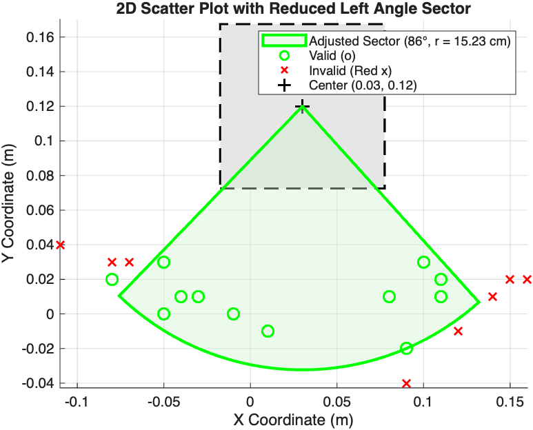

# Robotics Engineering Portfolio
**Aradhya Verma** | University of Wisconsin–Madison  
[verma48@wisc.edu](mailto:verma48@wisc.edu) | +1 (608)-217-8658

Autonomous systems, subsea avionics, and closed-loop manipulation portfolio.

---

## 1. FloatForm: Modular Self-Reconfiguring Robotic Boats
*Marine Robotics Laboratory | Research under Prof. Wei Wang*

Autonomous surface vessel (ASV) platform capable of multi-robot self-assembly, relative pose tracking, and autonomous docking maneuvers.

<table>
  <!-- Row 1: Picture 1 Left, Text Right -->
  <tr>
    <td width="48%">
      
    </td>
    <td width="52%">
      <h4>Modular Fleet Fabrication</h4>
      <ul>
        <li>Fabricated and assembled 5 autonomous surface vessel (ASV) units using 3D-printed resin hulls, laser-cut acrylic top plates, cross-fin stabilizers, and custom 4-thruster omnidirectional vector arrays.</li>
        <li>Wired and integrated onboard microcontrollers, power distribution, and motor drivers across all 5 units.</li>
      </ul>
    </td>
  </tr>

  <!-- Row 2: Text Left, Picture 2 Right -->
  <tr>
    <td width="52%">
      <h4>Auxetic Latching & Thrust Benchmarking</h4>
      <ul>
        <li>Built and bench-tested an origami-inspired auxetic permanent magnet latching mechanism driven by a central servo and 3D-printed gearbox to maintain zero-power rigid connection across adjacent modules.</li>
        <li>Conducted benchtop force sensor testing on miniature thrusters to evaluate dynamic response profiles, hydrodynamic deadbands, and rotational inertia compensation.</li>
      </ul>
    </td>
    <td width="48%">
      
    </td>
  </tr>

  <!-- Row 3: Graph Left, Text + Video Link Right -->
  <tr>
    <td width="48%">
      
    </td>
    <td width="52%">
      <h4>Perception Tracking & Empirical Capture Envelope</h4>
      <ul>
        <li>Integrated an OpenCV and AprilTag pipeline to estimate continuous inter-robot distance and relative angular heading during docking runs.</li>
        <li><b>Docking Verification Video:</b> <a href="test_19.mp4">▶ Click here to view in-water AprilTag docking video (test_19.mp4)</a></li>
        <li>Processed experimental docking trial coordinates in MATLAB to determine the empirical magnetic capture envelope (86° acceptance sector, 15.23 cm capture radius).</li>
        <li><b>Code & Data:</b> <a href="Scatterplot.m">Scatterplot.m</a> | <a href="latching_area.py">latching_area.py</a> | <a href="experiment_data.csv">experiment_data.csv</a></li>
        <li><b>Publication:</b> <em>Nature Communications</em> (2026) <a href="https://doi.org/10.1038/s41467-026-74527-6">doi:10.1038/s41467-026-74527-6</a></li>
      </ul>
    </td>
  </tr>
</table>

---

## 2. BlueROV Subsea Platform & Custom Payload Integration
*Marine Robotics Laboratory*

Underwater Remotely Operated Vehicle (ROV) configured for subsea maneuverability and auxiliary payload integration.

<table>
  <tr>
    <td width="50%">
      
    </td>
    <td width="50%">
      <h4>Chassis Packaging & Subsea Avionics</h4>
      <ul>
        <li><b>CAD & Chassis Design:</b> Modeled a custom internal mounting chassis in CAD to position and secure internal avionics, motor ESCs, terminal breakout blocks, and an onboard camera within a cylindrical acrylic pressure hull.</li>
        <li><b>Avionics Integration:</b> Built internal power and signal harnesses connecting an onboard Navigator/Arduino flight controller, high-current lithium power distribution, and tethered Ethernet for live telemetry.</li>
        <li><b>Hull Sealing & Dynamic Testing:</b> Assembled pressure enclosure using radial O-rings and sealed penetrators; calibrated thruster deadbands and executed in-tank dynamic testing via game controller to evaluate trim, buoyancy, and watertight sealing integrity.</li>
      </ul>
    </td>
  </tr>
</table>

---

## 3. Autonomous Pick-and-Place Manipulation (UR5e Capstone)
*Webots Robotics Simulation*

Autonomous color-based sorting pipeline utilizing a 6-DOF UR5e robotic manipulator and wrist-mounted RGB camera in Webots.

* <b>Simulation Demo:</b> <a href="capstone.MOV">▶ Click here to view the UR5e simulation video (capstone.MOV)</a>
* **Vision-Based Grasping:** Implemented color segmentation and centroid detection via a wrist-mounted RGB camera stream to calculate 3D object coordinates and trigger real-time grasp routines.
* **Kinematics & Trajectory Control:** Derived and implemented forward/inverse kinematics (FK/IK) and Jacobian-based path planning to execute smooth multi-axis pick-and-place trajectories.
* **Closed-Loop Automation:** Evaluated task reliability and fault-recovery behavior across repeated automated sorting cycles.
* **Project Artifacts:** [arm_ik.py](./arm_ik.py) | [color_sort_controller.py](./color_sort_controller.py) | [kinematic_helpers.py](./kinematic_helpers.py) | [color_sorting.wbt](./color_sorting.wbt)
```[cite: 1, 2, 5, 6, 7, 20]
